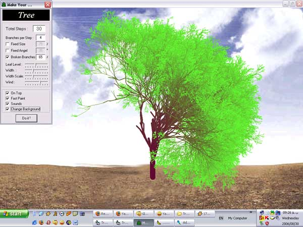



## Real Tree \(Branches &amp; Leaves\)

### Description

Think 3D !

Sometimes in programming, the current loop statements such as for...next or do...while can't help us and we need more.

This is a simple and funny program that shows you how a function can refer to itself and make a loop.

I use this function to make a tree, because I like trees, but you can use it for making virus growth simulation!, if you like.

This program may help beginners learn more about graphics, mathematical algorithms, fractals, API, recursive functions, sounds and some VB controls.

I'd like to hear from you, so please leave me a note.

----

August 15... First release.

----

August 17... Added "Leaf Level" &amp; "Width".

----

August 21... Added "Change Background" &amp; a few small changes in source code.

----

August 26... Added "Wind Direction" &amp; "OnTop" &amp; improved for using higher values of "Branches per Step".

----

August 30... Added "Width Scale".
 
### More Info
 

             |
---                |---
**Submitted On**   |2006-08-30 21:48:16
**By**             |[Mohammad Reza Khosravi](https://github.com/Planet-Source-Code/PSCIndex/blob/master/ByAuthor/mohammad-reza-khosravi.md)
**Level**          |Beginner
**User Rating**    |5.0 (130 globes from 26 users)
**Compatibility**  |VB 6\.0
**Category**       |[Math/ Dates](https://github.com/Planet-Source-Code/PSCIndex/blob/master/ByCategory/math-dates__1-37.md)
**World**          |[Visual Basic](https://github.com/Planet-Source-Code/PSCIndex/blob/master/ByWorld/visual-basic.md)
**Archive File**   |[Real\_Tree\_2019989152006\.zip](https://github.com/Planet-Source-Code/mohammad-reza-khosravi-real-tree-branches-amp-leaves__1-66280/archive/master.zip)

